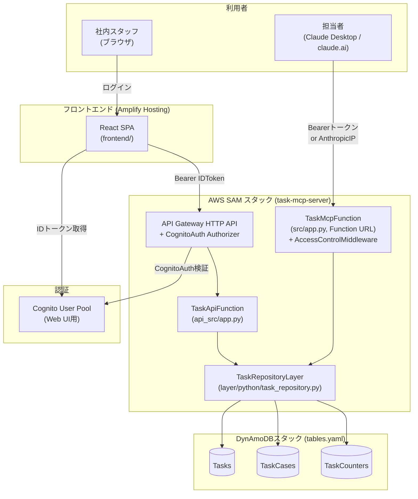

# タスク管理システム 設計書

最終更新: 2026-07-27
対象リポジトリ: `taskmanager`（AWS SAMモノレポ、スタック名 `task-mcp-server`）

> 本書はコードベース・インフラ定義（`template.yaml` / `tables.yaml` / `amplify.yml`）・README.md・コミット履歴を突き合わせて作成した設計書である。個人〜社内数名運用の小規模システムであるため、正式なフレームワークに則った過剰な設計ドキュメントは避け、**現状の実装がなぜその形になっているか**を中心にまとめる。

---

## 1. システム概要

- **用途**: 社内のタックス事務所（BPO: Business Process Outsourcing業務）向けのタスク管理ツール。
- **利用者**: 社内スタッフ数名（Web UI経由）、および担当者本人（Claude Desktop / claude.ai経由の自然言語操作）。
- **中核ドメイン概念**: 「案件（Client/Case）」に紐づく「タスク（Task）」を管理する。案件は`clientCode`（コード、完全一致検索キー）と`clientName`（表示名）の組で表現される。
- **最大の特徴**: **Web UIとClaude(MCP)という2つの利用インターフェースが、同一のDynamoDBデータソースを共有するデュアルインターフェース構成**。Web UIで更新した内容はClaude Skill経由でも即座に参照でき、逆にメールからClaude経由で自動作成されたタスクもWeb UI上でポーリング経由（4秒間隔）で確認できる。

### 開発の経緯（コミット履歴より）

| コミット | 日付 | 内容 |
|---|---|---|
| a87041c | 2026-06-30 | 初回コミット（27ファイル、6077行）。SAM + Lambda2種 + Reactフロントエンドの一式を一括構築 |
| b30d869 | 2026-06-30 | Amplifyモノレポビルド設定の修正（後述 7-2） |
| c6fea0b | 2026-07-27 | `customerName` → `clientCode`/`clientName` へのドメイン用語統一（後述 11-1） |
| 0e1b07a | 2026-07-27 | `setup手順.xlsx`（運用手順書）の更新 |

作者は一貫して単独（`woodygaragelab`）。約1ヶ月弱で構築された個人〜小規模運用のシステムであり、CI/CDやテストは未整備という前提を踏まえて読むこと。

---

## 2. 全体構成図



- インフラはCloudFormation/SAMで**2スタックに分離**されている: `tables.yaml`（DynamoDB、独立ライフサイクル）と`template.yaml`（Lambda・Cognito・API Gateway）。テーブルを消さずにアプリ側だけ再デプロイできるようにする意図と考えられる。
- 2つのLambda（Web API用・MCP用）は共通のLambda Layer（`task_repository`）を参照し、ビジネスロジックの二重実装を避けている。

---

## 3. 技術スタック

| レイヤ | 技術 |
|---|---|
| バックエンド言語 | Python 3.13 |
| MCPサーバー | `mcp`（公式SDK, `FastMCP`）+ `mangum`（ASGI→Lambdaアダプタ）+ `boto3` |
| Web API | フレームワーク不使用（API Gateway HTTP APIイベントを素朴にif分岐でルーティング）+ `boto3`（Lambda標準ランタイム同梱） |
| データストア | Amazon DynamoDB（`PAY_PER_REQUEST`、ORM・マイグレーションツール不使用） |
| 認証 | Amazon Cognito User Pool（Web UI）／独自Bearerトークン+IPホワイトリスト（MCP） |
| インフラIaC | AWS SAM（`AWS::Serverless-2016-10-31`） |
| フロントエンド | React 18 + Vite 5 |
| フロントエンド認証UI | `@aws-amplify/ui-react`（Authenticator）+ `aws-amplify` v6 |
| 状態管理 | なし（React標準の`useState`/`useEffect`のみ、Redux等未使用） |
| ルーティング | なし（実質1画面のstate駆動SPA、React Router未使用） |
| ホスティング | AWS Amplify Hosting（GitHub連携、pushで自動ビルド） |
| CI/CD | なし（Amplify Hostingの自動ビルドのみ、テスト実行やLintのパイプラインは未構築） |
| テスト | なし（テストコード・フレームワークともに未導入） |

---

## 4. バックエンド設計

### 4-1. `layer/python/task_repository.py` — 共通CRUDロジック（ビジネスロジックの中核）

Web API・MCPサーバーの両方から`import task_repository as repo`で参照される、フレームワーク非依存のプレーンな関数群。「ロジックの二重実装を避けるため、デコレータやルーティングに一切依存しない」という方針がコード冒頭に明記されている。

**主要関数**:

| 関数 | 役割 |
|---|---|
| `create_task(client_code, client_name, task_name, status, due_date, conclusion, assignee, thread_ids)` | `_next_task_id()`でIDを発番しPutItem。同時に案件マスタへ自動登録（`_ensure_case_exists`） |
| `get_task(task_id)` | GetItem。存在しなければ`TaskNotFoundError` |
| `update_task(task_id, status, conclusion, due_date, assignee)` | 指定フィールドのみUpdateExpressionで動的構築。`status`/`due_date`変化時は`statusSort`を再計算 |
| `list_tasks_by_client(client_code)` | GSI `CustomerStatusIndex`をQueryし、ソート済みで一覧取得 |
| `get_client_by_code(client_code)` | 案件マスタの完全一致取得（未登録なら`None`） |
| `link_email(task_id, thread_id)` | `list_append`で`sourceThreadIds`にGmailスレッドIDを追加 |

**設計上の工夫**:
- `_status_sort(status, due_date, task_id)`: `"{rank}#{due}#{task_id:06d}"`形式の複合文字列を生成し、DynamoDBの文字列ソートだけで「ステータス優先度→期限→ID」の3段階ソートを実現している。期限未設定（`"-"`）は`9999-12-31`扱いで末尾に回る。
- `_next_task_id()`: Countersテーブルへの`ADD`（アトミックインクリメント）でID発番。同時アクセスでも競合しない。
- `_ensure_case_exists()`: `ConditionExpression="attribute_not_exists(clientCode)"`付きPutItemで冪等に案件登録。`ConditionalCheckFailedException`（＝既存）は正常系として握りつぶす。

### 4-2. `src/app.py` — MCPサーバー（Claude Desktop / claude.ai向け）

`FastMCP("task-manager", stateless_http=True, json_response=True, streamable_http_path="/")` によるStreamable HTTP方式のMCPサーバー。`TOOL_FUNCTIONS`に`task_repository`の6関数をそのまま`mcp.add_tool()`で登録し、MCPツールとして公開している。

**Lambda呼び出しごとにアプリを再構築する設計**: `StreamableHTTPSessionManager.run()`はインスタンスごとに1回しか呼べない制約があるため、`FastMCP`インスタンスをモジュールレベルで使い回さず、`handler(event, context)`の呼び出し毎に`build_app()`で新規構築している（`stateless_http=True`はこの前提に基づく）。実行時は`Mangum(app, lifespan="auto")`でASGI→Lambdaイベント変換。

**認可（`AccessControlMiddleware`、StarletteのBaseHTTPMiddleware継承）**: Function URL自体の`AuthType`は`NONE`だが、アプリ内ミドルウェアで以下のいずれかを満たさない限り401を返す。
1. `Authorization: Bearer <MCP_AUTH_TOKEN>` が環境変数値と一致（Claude Desktop + mcp-remote経由）
2. 送信元IPがAnthropicの公開アウトバウンドIPレンジ（`160.79.104.0/21`）内（claude.ai/モバイルのカスタムコネクタ経由）

### 4-3. `api_src/app.py` — Web API（社内フロントエンド向け）

Flask/FastAPI等のフレームワークは使用せず、`event["routeKey"]`（例: `"GET /tasks/{taskId}"`）による素朴なif分岐でルーティングを自前実装している。

| Method | Path | 処理 |
|---|---|---|
| GET | `/customers/{clientCode}` | `repo.get_client_by_code` |
| GET | `/customers/{clientCode}/tasks` | `repo.list_tasks_by_client` |
| GET | `/tasks/{taskId}` | `repo.get_task` |
| POST | `/tasks` | `repo.create_task`（`clientCode`/`clientName`/`taskName`必須チェック） |
| PATCH | `/tasks/{taskId}` | `repo.update_task` |
| POST | `/tasks/{taskId}/emails` | `repo.link_email` |

- レスポンスは`_response()`ヘルパーでCORSヘッダとJSON形式（`ensure_ascii=False`で日本語をエスケープしない）を統一。
- エラーは`TaskNotFoundError`→404、`KeyError`/`ValueError`→400、その他`Exception`→500の3段階。
- JWT検証はこのLambda自身では行わず、**API Gateway側の`CognitoAuth`オーソライザーに委譲**している（認可後のリクエストのみを扱う設計）。

---

## 5. データモデル設計（現行実装）

> **検討中の再設計について**: 本章は現行実装（コード上の実態）を記述したものである。「案件」概念の見直しと、タスクを Series×Frame に分解する再設計を [14. データモデル再設計（検討中）](#14-データモデル再設計検討中未実装) にまとめている。**現時点ではコード・実データへの反映は行っていない**（設計フェーズ）。

DynamoDB（NoSQL、ORM・マイグレーション不使用、`boto3.resource("dynamodb")`を直接操作）。`tables.yaml`でLambdaスタックとは別のCloudFormationスタックとして管理。

### 5-1. Tasks テーブル

```
PK: taskId (Number, アトミックカウンタ発番の永続ID)
GSI "CustomerStatusIndex": clientCode (HASH) + statusSort (RANGE) , ProjectionType ALL
BillingMode: PAY_PER_REQUEST
```
コメントで「~100,000 items expected」と規模を見積もり済み。

| 属性 | 型 | 説明 |
|---|---|---|
| taskId | N (PK) | アトミック発番の整数ID |
| clientCode | S | 案件コード（旧`customerName`から改名） |
| clientName | S | 案件名 |
| taskName | S | タスク名 |
| status | S | `要対応`/`決定済`/`情報`/`完了`の4段階 |
| dueDate | S | `YYYY-MM-DD` / `-`（未定）/ `至急` |
| conclusion | S | 結論・自由記述 |
| assignee | S | 担当者 |
| sourceThreadIds | List\<S\> | 紐づくGmailスレッドID群 |
| dependsOn | List | タスク依存関係。**未使用の予約フィールド**（参照ロジックなし、将来拡張用） |
| statusSort | S | GSI用の複合ソートキー（4-1参照） |
| createdAt / updatedAt | S | UTC ISO8601 |

### 5-2. TaskCases テーブル（案件マスタ）

```
PK: lookupBucket (String, 固定値 "CASE" のみ運用)
SK: clientCode (String)
```
属性は`lookupBucket`, `clientCode`, `clientName`のみ。`lookupBucket`を固定値で運用する設計は、将来的なバケット分割（例: 会社単位のグルーピング）を見込んだ拡張余地と考えられるが、現状は単一バケット運用。README「未実装・今後の検討事項」に「会社名（companyName）と案件名（caseName）の分離」が挙がっており、案件マスタの正規化は将来課題として認識されている。

### 5-3. TaskCounters テーブル（ID発番用）

```
PK: counterName (String)
```
`counterName="taskId"`の1レコードのみを`ADD`アトミック演算でインクリメントする単純なシーケンス生成用テーブル。

---

## 6. フロントエンド設計

### 6-1. コンポーネント構成（`frontend/src/`）

```
main.jsx          エントリポイント。Amplify.configure() → Authenticatorでログイン画面をラップ
App.jsx           メイン画面。案件選択状態(client)を保持し、他コンポーネントを統括
CustomerSearch.jsx  案件コード完全一致検索（デバウンス250ms）＋未登録時のインライン新規登録UI
TaskTable.jsx      タスク一覧テーブル。担当/結論はインライン編集(onBlurコミット)、状態はStatusStampボタン
StatusStamp.jsx    ステータスを次段階へ進めるボタン(要対応→決定済→情報→完了→循環)
NewTaskForm.jsx    新規タスク作成フォーム
api.js             fetchベースのAPIクライアント(Cognitoトークン付与)
config.js          デプロイ後の値(Cognito ID・APIエンドポイント)を反映する設定ファイル
```

- **状態管理**: Redux等は不使用。`App.jsx`トップレベルの`useState`（client/tasks/loading/error/lastSynced）をpropsで配布する素朴な構成。
- **ルーティング**: React Router等は不使用。URLベースの複数ページ構成はなく、実質1画面のstate駆動アプリ（案件未選択時は検索案内、選択後は一覧＋新規作成フォーム）。
- **疑似リアルタイム同期**: `POLL_INTERVAL_MS = 4000`で案件選択中は4秒間隔ポーリング。README「未実装・今後の検討事項」に「DynamoDB Streams + AppSync、またはWebSocket APIによるPush型への置き換え」が挙がっている。
- **楽観的UI更新**: `handleUpdate`はAPIコール前にローカル状態を即時更新し、失敗時は`refresh()`でサーバー状態に揃え直す。

### 6-2. デザイン方針

社内のタックス事務所向け業務ツールという位置付けから、SaaS風ではなく「台帳・帳簿」をモチーフにした配色・タイポグラフィを採用。ステータスは日本の業務文書になじみのある「印影（はんこ）」風のバッジ（`StatusStamp.jsx`）で表現。CSS変数によるデザイントークン管理（`--paper`, `--ink`, `--stamp-red`, `--seal-green`等）、フォントはShippori Mincho / Zen Kaku Gothic New / JetBrains Mono。

---

## 7. 認証・認可設計

2系統の認証方式が併存する。

### 7-1. Web UI向け（Cognito）
- User Pool: セルフサインアップ無効（`AdminCreateUserConfig.AllowAdminCreateUserOnly: true`）、管理者が`admin-create-user`でアカウント作成する運用。
- パスワードポリシー: 最小10文字、大文字/小文字/数字必須。
- API GatewayのHTTP APIに`CognitoAuth`というJWT Authorizerを全ルートのデフォルトとして適用（`DefaultAuthorizer: CognitoAuth`）。
- フロントエンドは`fetchAuthSession()`からIDトークンを取得し`Authorization: Bearer <IDToken>`を全リクエストに付与。
- **RBACなし**: ロールベースのアクセス制御は未実装。認証されたユーザーは全員同じ権限を持つ（社内数名向けという前提での簡略化）。

### 7-2. MCPサーバー向け（Bearer / IPホワイトリスト）
Cognitoは使わず、`AccessControlMiddleware`による固定Bearerトークンまたは Anthropic公開IPレンジでの認可（4-2参照）。トークンは`NoEcho: true`のSAMパラメータとして管理。

### 7-3. 既知のセキュリティ課題
README記載の通り、`HttpApi.CorsConfiguration.AllowOrigins`が現状`"*"`のままであり、**本番運用前にAmplify Hostingの実ドメインへ限定する必要がある**（未対応）。

---

## 8. インフラ・デプロイ構成

### 8-1. AWS SAM
- `tables.yaml`: DynamoDB3テーブルの独立スタック（初回のみ個別デプロイ、Lambdaスタックとは疎結合のライフサイクル）。
- `template.yaml`: `TaskRepositoryLayer`（共通Layer）／`TaskMcpFunction`（Function URL）／`UserPool`+`UserPoolClient`（Cognito）／`HttpApi`（Cognito JWT Authorizer付き）／`TaskApiFunction`（6イベント定義）を1スタックにまとめたメインスタック。
- 両Functionとも`DynamoDBCrudPolicy`（SAM組み込みポリシーテンプレート）を3テーブルに付与。
- `samconfig.toml`: `stack_name = "task-mcp-server"`, `region = "ap-northeast-1"`, `capabilities = "CAPABILITY_IAM"`。

### 8-2. Amplify Hosting（フロントエンド）
`amplify.yml`は**リポジトリルート直下**に配置する必要がある（`appRoot: frontend`を明示するモノレポ形式）。

**b30d869「Fix Amplify monorepo build config」の経緯**: 当初`frontend/amplify.yml`に`applications`キーなしのシンプル形式で配置していたが、Amplify Hostingのモノレポ検出との不整合で`Monorepo spec provided without "applications" key`エラーが発生。`applications`キーで`appRoot: frontend`を明示する形式に書き換え、ルート直下に移動して解消した。README内にも「`frontend/`配下に単純な`amplify.yml`を置くとエラーになるため、必ずルート直下のものを使うこと」という運用上の注意書きがある。

デプロイフロー: GitHub連携 → Amplify Hostingコンソールでリポジトリ・ブランチ選択 → ビルド設定自動検出 → `main`ブランチpushごとに自動ビルド・デプロイ。

### 8-3. CI/CD・テスト
GitHub Actions等のCIパイプラインは存在しない。バックエンドは手動`sam deploy`、フロントエンドはAmplify Hostingのpush検知ビルドのみ。テストコード・テストフレームワークともに未導入。個人〜小規模運用であるため現状は許容されているが、**利用者・データ量が増える場合は最低限のスモークテストとCI導入を検討すべき**。

---

## 9. 設定・環境変数

`.env`ファイルは存在せず、設定は2箇所に分散している。

**バックエンド（Lambda環境変数、`template.yaml`定義）**:
```
TASKS_TABLE, CASES_TABLE, COUNTERS_TABLE   （両Function共通）
MCP_AUTH_TOKEN                              （TaskMcpFunctionのみ、NoEcho）
```
`task_repository.py`はモジュールロード時に`os.environ[...]`を必須参照するため、未設定だと起動時に即座に失敗する。

**フロントエンド（`frontend/src/config.js`、ビルド時に静的埋め込み）**:
```js
amplifyConfig.Auth.Cognito.userPoolId / userPoolClientId
API_BASE_URL
```
`sam deploy`のOutputs値を手動でこのファイルに反映する運用。Vite標準の`.env`/`import.meta.env`は使われておらず、**環境ごとの分岐（dev/staging/prod）は存在しない**（単一環境: `ap-northeast-1`のみを想定）。

---

## 10. ドメインモデル用語集

| 用語 | 説明 |
|---|---|
| 案件（Client/Case） | `clientCode`（コード）と`clientName`（表示名）の組。タスク作成時に未登録なら自動でマスタ登録される「登録不要・使ったら生成される」設計 |
| タスク（Task） | 永続的整数ID(`taskId`)を持つ、案件に紐づく作業項目 |
| ステータス | `要対応`→`決定済`→`情報`→`完了`の4段階。`StatusStamp.jsx`のボタンで一方向に進む（戻る操作はUI上未対応） |
| メール連携 | `sourceThreadIds`でGmailスレッドとタスクを多対1で関連付け。Claude Skill経由の「関連メール表示」機能で利用 |
| `dependsOn` | タスク間の依存関係を持たせるための予約フィールド。現状ロジック未実装 |

### 用語統一の経緯（c6fea0b「customerName→clientCodeに変更」）
初回コミット時点では「顧客」を表す何らかの識別子キー（`customerName`）が使われていたが、14ファイルに渡る一括変更で`clientCode`（案件コード）+ `clientName`（案件名）という2属性に分離・改名された。これにより現在は「顧客（customer）」ではなく「案件（client/case）」という業務概念にドメインが統一されている。**ただしGSI名`CustomerStatusIndex`には旧称`Customer`が命名上残存**しており、リネームは意図的に見送られている（インデックス名の変更はテーブル再作成を伴うため）。同時に`skill/bpo-task-manager/SKILL.md`が追加されており、"BPO"（業務委託代行）という単語から、税理士事務所などの外部委託業務向けであることが裏付けられる。

---

## 11. 既存ドキュメントとの対応

- `README.md`: デプロイ手順・エンドポイント一覧・Cognitoユーザー作成手順など運用寄りの情報を保持。本設計書とは相互補完の関係にあり、実際の操作手順はREADME.mdを参照すること。
- `setup手順.xlsx`: 運用手順のExcelチェックリスト（バイナリのため本書では内容を反映できず）。
- `skill/SKILL.md` / `skill/bpo-task-manager/SKILL.md`: Claudeへの振る舞い指示書だが、ステータス判定基準や案件コードの扱いなど業務ロジックのドメイン知識が含まれる一次情報。

---

## 12. 未実装・今後の検討事項（既知の課題の棚卸し）

| # | 課題 | 影響 |
|---|---|---|
| 1 | CORS設定が`AllowOrigins: "*"` | 本番運用前にAmplifyの実ドメインへ限定が必要（セキュリティ） |
| 2 | 案件マスタの`companyName`/`caseName`分離未実施 | 同一会社に複数案件がある場合の集計・検索性 |
| 3 | ポーリング方式（4秒間隔）でのタスク一覧更新 | DynamoDB Streams + AppSyncまたはWebSocket APIへの置き換えでリアルタイム性向上の余地 |
| 4 | `dependsOn`フィールドが未使用 | タスク依存関係・ブロッカー管理機能は未実装（データ構造のみ予約済み） |
| 5 | RBAC（権限分離）なし | 利用者が増えた場合、担当者ごとのアクセス制御が必要になる可能性 |
| 6 | テスト・CI/CD未整備 | 変更の回帰確認が手動デプロイ後の目視のみ |
| 7 | ステータス遷移が一方向のみ | 誤操作時に前のステータスへ戻す手段がUI上にない |

---

## 13. 参照した主要ファイル

- `README.md` / `template.yaml` / `tables.yaml` / `amplify.yml` / `samconfig.toml`
- `src/app.py` / `src/requirements.txt`
- `api_src/app.py`
- `layer/python/task_repository.py`
- `frontend/src/*.jsx` / `frontend/src/api.js` / `frontend/src/config.js` / `frontend/package.json`
- `skill/SKILL.md` / `skill/bpo-task-manager/SKILL.md`

---

## 14. データモデル再設計（検討中・未実装）

> **ステータス**: 概念設計のみ確定。**コード（frontend/backend）・実データへの反映は未着手**。物理DynamoDBスキーマ（GSI設計等）は次フェーズで検討する。

### 14-1. 再設計の動機

現行モデル（5章）の「案件（Case）」概念が実態と合っていなかった。`clientCode`/`clientName`という属性名は既に「クライアント」を指していたにもかかわらず、ドキュメント上は「案件」と呼んでいたというズレがあった。これを機に「案件」という言葉を廃し、**「クライアント（Client）」に一本化**する。

さらに、現行の「1タスク＝1レコード（`要対応/決定済/情報/完了`のフラットなステータスを持つ単一エンティティ）」という粒度では、「毎月発生する定型業務の、どの月分がどこまで進んでいるか」を表現できていなかった。このため、タスクを **シリーズ（業務の種類）× フレーム（対象月）** の組み合わせに分解し、その最小単位ごとに進捗を持たせる構造に変更する。

例: 「6月の資料受領は担当者佐藤により、7/20に完了した」を素直に記録できるようにする。

### 14-2. 新しい中核エンティティ

| エンティティ | 属性 | 説明 |
|---|---|---|
| **Client**（クライアント） | `clientCode`（PK）, `clientName` | 旧「案件（Case）」概念を廃止し統合。属性は現行から変更なし |
| **Series**（シリーズ） | `SeriesCode`（PK）, `SeriesName` | 業務の種類。例: 「資料受領」「資料整理」「データ入力」。クライアント横断の共通マスタ |
| **Frame**（フレーム） | `FrameCode`（PK, 年を含む形式 例: `202606`）, `FrameName` | タスクの対象タイムフレーム。例: 「2026年6月」。年ごとに別レコードになる（月のみを固定マスタにはしない） |
| **Task**（タスク） | `ClientCode` + `SeriesCode` + `FrameCode`（複合キー）, `Status`, `Assignee`, `CompleteDate` | 最小単位の作業。あるクライアントの、あるシリーズの、あるフレーム分の進捗を1レコードで表す |

**Client × Series × Frame の関係**:
- Series・Frameはクライアント横断の共通マスタ（クライアントごとに個別定義はしない）。
- Taskが `ClientCode + SeriesCode + FrameCode` を持つことで、「どのクライアントの・どの業務の・どの月分か」を一意に表す。
- Client・Series・Frameのいずれも**事前登録は不要**。存在しないコードでTaskを作成した時点で、現行の`_ensure_case_exists()`と同様の「使ったら自動登録」方式でマスタに追加される（設計方針の一貫性を維持）。

### 14-3. Status（ステータス）の見直し

`CompleteDate`が独立属性として分離されたため、Statusは進捗の分類のみを表す最小構成に単純化する。

```
未着手 → 進行中 → 完了
```
旧モデルの4段階（要対応/決定済/情報/完了）から3段階に削減。「結論（conclusion）」のような自由記述の情報は持たない。

### 14-4. 廃止する旧属性

新Taskエンティティでは以下を**廃止**する（引き継がない）。

| 旧属性 | 廃止理由 |
|---|---|
| `taskId`（連番ID） | `ClientCode+SeriesCode+FrameCode`の複合キーが一意性を保証するため不要 |
| `dueDate` | Frame（対象月）が期限相当の時間軸情報を代替する |
| `conclusion` | 自由記述の結論欄は新モデルの対象外（今回のスコープでは持たない） |
| `sourceThreadIds`（メールスレッド連携） | 新モデルの対象外。必要になった場合は別途検討 |
| `dependsOn`（タスク依存関係） | 元々未使用の予約フィールドであり、新モデルでも採用しない |

### 14-5. 旧モデルとの対応関係（用語マッピング）

| 旧（現行実装） | 新（再設計） |
|---|---|
| 案件（Case） / `TaskCases`テーブル | クライアント（Client） |
| タスク1レコード＝1件の作業（フラット） | タスク1レコード＝Client×Series×Frameの最小単位 |
| ステータス4段階（要対応/決定済/情報/完了） | ステータス3段階（未着手/進行中/完了） |
| `GSI: CustomerStatusIndex`（`clientCode`+`statusSort`） | 未検討（クエリパターンの再整理が必要、14-6参照） |

### 14-6. アクセスパターンの確認結果

物理スキーマを決める前提として、以下のアクセスパターンを確認済み。

| アクセスパターン | 必要性 |
|---|---|
| クライアント単位でのタスク一覧取得 | 必要（既存同様、基本操作） |
| 「あるフレーム・あるシリーズのタスクを全クライアント横断で一覧」（例: 6月の資料受領を全クライアント分確認） | **不要**。クライアント単位の確認が基本運用 |
| 登録済み全クライアントの一覧取得（ドロップダウン選択等） | 必要 |
| 登録済み全Series/Frameの一覧取得（Task作成時のドロップダウン選択） | 必要 |
| クライアント別タスク一覧のソート順 | シリーズ内でフレーム順（SeriesCode→FrameCode） |

横断集計クエリが不要と判断されたため、Tasksテーブルへの**GSIは不要**という結論になった。

### 14-7. 物理DynamoDBスキーマ（確定）

テーブル構成は「エンティティごとに分ける」方針（4テーブル）を採用。現行の`tables.yaml`（Tasks / TaskCases / TaskCounters の3テーブル）を、以下の4テーブルに置き換える想定。**`taskId`発番用の`TaskCounters`テーブルは複合キー化により不要になるため削除する。**

#### Clients テーブル
```
PK: lookupBucket (String, 固定値 "CLIENT")
SK: clientCode (String)
属性: clientName
```
Query(PK="CLIENT")で登録済み全クライアントを一覧取得できる。個別取得はQuery(PK="CLIENT", SK=clientCode)。現行`TaskCases`の`lookupBucket`パターンを踏襲し、命名の一貫性を保つ。

> **登録方式の例外（16章で確定）**: Series/Frameは「Task作成時の自動登録のみ」で統一するが、**Clientのみドロップダウンからの明示的な新規登録操作があるため、専用の登録エンドポイント（`POST /clients`）を設ける**。ClientはTask作成前に単独で選択・登録される画面上の存在であるのに対し、Series/FrameはTask作成フローの中でのみ選択される存在であるため、この非対称な扱いとした。

#### Series テーブル
```
PK: lookupBucket (String, 固定値 "SERIES")
SK: seriesCode (String)
属性: seriesName
```
Query(PK="SERIES")で登録済み全シリーズを一覧取得（Task作成時のドロップダウン用）。

#### Frames テーブル
```
PK: lookupBucket (String, 固定値 "FRAME")
SK: frameCode (String, 例 "202606")
属性: frameName
```
Query(PK="FRAME")で登録済み全フレームを一覧取得。`frameCode`を`YYYYMM`のゼロ埋め文字列にしているため、**文字列ソートがそのまま時系列順になる**（追加のソートキー加工が不要）。

#### Tasks テーブル
```
PK: clientCode (String)
SK: seriesCode#frameCode (String, 例 "SR001#202606")
属性: seriesCode, frameCode, status, assignee, completeDate, createdAt, updatedAt
```
Query(PK=clientCode)でクライアント別タスク一覧を取得。SKを`{seriesCode}#{frameCode}`の連結文字列にすることで、**追加のインデックスなしに「シリーズ内でフレーム順」の並びが手に入る**（`frameCode`が`YYYYMM`形式のため、同一シリーズ内は時系列順）。単一タスクの取得・更新はGetItem/UpdateItem(PK=clientCode, SK=seriesCode#frameCode)で完結し、旧`taskId`のような代理キーは不要。横断集計が不要なためGSIは持たない。

**マスタ自動登録の一貫性**: Clients/Series/Framesいずれも、現行の`_ensure_case_exists()`と同じ「`ConditionExpression: attribute_not_exists(...)`付きPutItemで冪等に登録し、`ConditionalCheckFailedException`（既存）は正常系として握りつぶす」パターンを踏襲する。事前登録画面は不要で、Task作成時に存在しないコードが指定されたら自動でマスタに追加される。

### 14-8. 未決定・次フェーズで検討する事項

- **既存データの移行**: 不要と判断（旧データからの変換は行わない。新モデルは移行を前提とせずゼロから運用開始する）。
- **frontend/backendコードへの反映**: 本設計が確定した後に着手する（現時点では未着手・変更禁止）。フロントエンド実装方針は15章で検討中。

---

## 15. フロントエンド実装方針（検討中・未実装）

> **ステータス**: UI方針のみ確定。**コード（`frontend/`配下）への反映は未着手**。14章のデータモデル・物理スキーマの確定を受けたUI設計。

### 15-1. 確定した方針

| 論点 | 決定内容 |
|---|---|
| クライアント選択UI | 完全一致検索から**全件リストからのドロップダウン/オートコンプリート選択**に変更（Clientsテーブルの「全件一覧取得」パターンが可能になったため） |
| タスク一覧の表示形式 | **フラットリストを継続**（現行`TaskTable.jsx`の拡張）。マトリクス表示は不採用 |
| タスク一覧のソート順 | シリーズ内でフレーム順（SeriesCode→FrameCode）。14-7のTasksテーブルSK設計がそのまま反映される |
| タスク作成フロー | **1件ずつ手動作成**（現行`NewTaskForm.jsx`の拡張）。一括生成は不採用 |
| ステータス切り替えUI | **ドロップダウンで任意の値を選択**（未着手/進行中/完了を自由に行き来可能）。現行`StatusStamp.jsx`の一方向進行ボタンは廃止 |
| CompleteDate設定 | **手動入力**。Statusの変更と連動した自動設定は行わない |

### 15-2. 現行コンポーネントとの対応（設計メモ、未実装）

| 現行コンポーネント | 新モデルでの位置付け |
|---|---|
| `CustomerSearch.jsx` | 役割変更: 検索UIから「全クライアント一覧＋選択」UIへ。命名も「案件/顧客」から「クライアント」への統一に合わせて見直す想定 |
| `NewTaskForm.jsx` | 拡張: クライアントは選択済み前提、Series/Frameをドロップダウンで選択（未登録コードの場合はインライン新規登録、`CustomerSearch.jsx`の既存パターンを踏襲） |
| `TaskTable.jsx` | 列構成変更: Series名/Frame名/Status（ドロップダウン）/Assignee（インライン編集）/CompleteDate（日付入力）。`taskName`/`conclusion`列は廃止 |
| `StatusStamp.jsx` | **廃止**。ドロップダウン（`<select>`等）に置き換え |
| `api.js` | 呼び出し対象がバックエンドAPI設計に依存するため未確定（16章相当、次フェーズ） |

### 15-3. 状態管理・同期方式について

今回のヒアリングでは変更の要望が出ていないため、以下は**現状維持を仮定**する。変更したい場合は別途検討する。

- 状態管理: Redux等は導入せず、`useState`/`useEffect`によるローカル状態管理を継続
- ルーティング: React Router等は導入せず、state駆動の単一画面構成を継続
- 同期方式: 4秒間隔ポーリングを継続（Push型への変更は本フェーズのスコープ外）

### 15-4. 未決定・次フェーズで検討する事項

- バックエンドAPI（`api_src/app.py`）のエンドポイント設計（新エンティティCRUD、一覧取得系エンドポイントの追加）。→ 16章で確定。
- 上記に伴う`frontend/src/api.js`の呼び出しインターフェース。
- 実際のコンポーネント実装（本章はUI方針の確定のみで、コードへの反映はまだ行わない）。

---

## 16. バックエンドAPI設計（検討中・未実装）

> **ステータス**: エンドポイント・ツール一覧のみ確定。**コード（`api_src/app.py`, `src/app.py`, `layer/python/task_repository.py`）への反映は未着手**。設計対象はWeb API・MCPサーバーの両方（`task_repository`を共有しているため一体で設計する）。

### 16-1. メール連携機能の廃止（重要な影響範囲）

14章の決定（`sourceThreadIds`廃止）に伴い、**メールスレッド連携機能そのものを廃止する**。これにより以下が影響を受ける。

- Web API: `POST /tasks/{taskId}/emails` エンドポイントを削除
- MCPサーバー: `link_email`ツールを削除
- `task_repository.py`: `link_email()`関数を削除
- `skill/SKILL.md` / `skill/bpo-task-manager/SKILL.md`: 「メールからタスクを作成・関連付け」に関する記述の見直しが必要（本設計フェーズの対象外、別途対応）
- `email_router.py`: README・SKILL.mdで言及されている外部連携スクリプトだが、**本リポジトリには存在しない外部システム**。そちらの連携仕様変更は本リポジトリの設計スコープ外だが、影響を受けることは関係者に伝達が必要

### 16-2. Web APIエンドポイント一覧（新モデル）

| Method | Path | 処理 | 備考 |
|---|---|---|---|
| GET | `/clients` | 全クライアント一覧取得 | クライアント選択ドロップダウン用（15-1） |
| POST | `/clients` | クライアント新規登録 | body: `clientCode,clientName`。ドロップダウンの「新規作成」操作専用（14-7例外）。既存`clientCode`が指定された場合は409エラーとする想定（要確認、16-5） |
| GET | `/series` | 全シリーズ一覧取得 | タスク作成時のドロップダウン用 |
| GET | `/frames` | 全フレーム一覧取得 | タスク作成時のドロップダウン用。時系列順 |
| GET | `/clients/{clientCode}/tasks` | クライアント別タスク一覧取得 | シリーズ→フレーム順にソート済み |
| GET | `/tasks/{clientCode}/{seriesCode}/{frameCode}` | 単一タスク取得 | 複合キーをパスパラメータ3つで表現 |
| POST | `/tasks` | タスク作成 | body: `clientCode,seriesCode,seriesName,frameCode,frameName,status?,assignee?,completeDate?`。`clientCode`は事前に`POST /clients`で登録済みであることが前提（`clientName`は渡さない）。Series/Frameが未登録なら自動登録 |
| PATCH | `/tasks/{clientCode}/{seriesCode}/{frameCode}` | タスク更新 | body: `status?,assignee?,completeDate?` |

**廃止するエンドポイント**: `GET /customers/{clientCode}`（一覧取得`/clients`に統合）、`GET /tasks/{taskId}`・`PATCH /tasks/{taskId}`（連番`taskId`廃止のため複合キー方式に置き換え）、`POST /tasks/{taskId}/emails`（16-1）。

認証・エラーハンドリング・CORS・レスポンス形式（`_response()`ヘルパー、JSONエラー3段階）は現行方針を継続する。

### 16-3. MCPツール一覧（新モデル）

`FastMCP`に登録するツール関数を、`task_repository`の新関数と1:1で対応させる現行方針を継続する。

| ツール | 対応するWeb API相当 |
|---|---|
| `list_clients()` | `GET /clients` |
| `create_client(client_code, client_name)` | `POST /clients` |
| `list_series()` | `GET /series` |
| `list_frames()` | `GET /frames` |
| `list_tasks_by_client(client_code)` | `GET /clients/{clientCode}/tasks` |
| `get_task(client_code, series_code, frame_code)` | `GET /tasks/{clientCode}/{seriesCode}/{frameCode}` |
| `create_task(client_code, series_code, series_name, frame_code, frame_name, status, assignee, complete_date)` | `POST /tasks` |
| `update_task(client_code, series_code, frame_code, status, assignee, complete_date)` | `PATCH /tasks/{clientCode}/{seriesCode}/{frameCode}` |

**廃止するツール**: `link_email`（16-1）、`get_client_by_code`（`list_clients`で代用するため不要と確定）。同じ考え方で`get_series_by_code`／`get_frame_by_code`のような単体取得ツールも設けない（`list_series`／`list_frames`で代用）。

認証（`AccessControlMiddleware`によるBearerトークン／Anthropic IPホワイトリスト）、Lambda呼び出しごとのアプリ再構築（`build_app()`）といった実装上の制約は変更なし。

### 16-4. `task_repository.py` 新関数一覧（設計レベル）

| 関数 | 役割 |
|---|---|
| `list_clients()` | Clientsテーブルを`Query(PK="CLIENT")`し全件返す |
| `create_client(client_code, client_name)` | `ConditionExpression: attribute_not_exists(clientCode)`でPutItem。既存の場合は`ConditionalCheckFailedException`を握りつぶさず呼び出し元にエラーを返す点が、他マスタの自動登録（`_ensure_*_exists`系）と異なる |
| `list_series()` | Seriesテーブルを`Query(PK="SERIES")`し全件返す |
| `list_frames()` | Framesテーブルを`Query(PK="FRAME")`し全件返す（`frameCode`昇順で自然に時系列順） |
| `list_tasks_by_client(client_code)` | Tasksテーブルを`Query(PK=clientCode)`し、SK（`seriesCode#frameCode`）順に返す |
| `get_task(client_code, series_code, frame_code)` | Tasksテーブルを`GetItem(PK=clientCode, SK=seriesCode#frameCode)` |
| `create_task(...)` | `_ensure_series_exists()`/`_ensure_frame_exists()`（14-7の冪等パターン）を経てPutItem。`clientCode`は自動登録せず、事前に`create_client()`で登録済みであることを前提とする |
| `update_task(client_code, series_code, frame_code, status, assignee, complete_date)` | 指定フィールドのみUpdateExpressionで動的構築（現行`update_task`と同様の設計） |

`_status_sort`のような複合ソートキー生成ロジックは、SK自体（`seriesCode#frameCode`）が既にソート順を表現するため**不要**（14-7参照）。`_next_task_id()`も`taskId`廃止に伴い不要。

### 16-5. 未決定・次フェーズで検討する事項

- `POST /clients`で既存`clientCode`が指定された場合のエラーレスポンス仕様の最終確認（現時点では409相当を仮定）。
- 実際のコード実装（`api_src/app.py` / `src/app.py` / `layer/python/task_repository.py` / `tables.yaml`）。本設計フェーズでは未着手・変更禁止。
- `skill/SKILL.md`等のメール連携記述の見直し（16-1、本設計スコープ外）。

---

## 17. `frontend/src/api.js` 呼び出しインターフェース設計（検討中・未実装）

> **ステータス**: インターフェース設計のみ確定。**`frontend/src/api.js`本体への反映は未着手**。既存の共通ヘルパー（`authHeader()`によるCognito IDトークン付与、`request()`によるfetchラップとエラー変換）はそのまま踏襲する。

### 17-1. 現行実装の構成（踏襲する部分）

```js
async function authHeader() { ... }          // Cognito IDトークンをAuthorizationヘッダに付与
async function request(path, { method, body }) { ... }  // fetch + JSON変換 + エラー時throw
export const api = { /* エンドポイントごとの薄いラッパー */ };
```
この「共通`request()`ヘルパー＋`api`オブジェクトの薄いラッパー」という構造自体は変更しない。変更するのは`api`オブジェクトが持つメソッドの一覧のみ。

### 17-2. 新しい `api` オブジェクト（設計案）

```js
export const api = {
  listClients: () =>
    request(`/clients`),

  createClient: (clientCode, clientName) =>
    request(`/clients`, { method: "POST", body: { clientCode, clientName } }),

  listSeries: () =>
    request(`/series`),

  listFrames: () =>
    request(`/frames`),

  listTasksByClient: (clientCode) =>
    request(`/clients/${encodeURIComponent(clientCode)}/tasks`),

  createTask: (task) =>
    request(`/tasks`, { method: "POST", body: task }),
    // task = { clientCode, seriesCode, seriesName, frameCode, frameName, status?, assignee?, completeDate? }

  updateTask: (clientCode, seriesCode, frameCode, patch) =>
    request(
      `/tasks/${encodeURIComponent(clientCode)}/${encodeURIComponent(seriesCode)}/${encodeURIComponent(frameCode)}`,
      { method: "PATCH", body: patch }
    ),
    // patch = { status?, assignee?, completeDate? }
};
```

### 17-3. 現行からの変更点

| 現行 | 新設計 | 変更理由 |
|---|---|---|
| `getClient(clientCode)` | 削除 | `GET /customers/{clientCode}`廃止（16-2）。`listClients()`の結果から参照する運用に統一 |
| （なし） | `listClients()` 追加 | クライアント選択ドロップダウン用（15-1） |
| （なし） | `createClient(clientCode, clientName)` 追加 | ドロップダウンの「新規作成」操作専用（16-2の`POST /clients`例外） |
| `listTasksByClient(clientCode)` | パスを`/customers/{clientCode}/tasks`→`/clients/{clientCode}/tasks`に変更 | エンドポイントパスの見直し（16-2） |
| （なし） | `listSeries()` / `listFrames()` 追加 | タスク作成フォームのドロップダウン用（15-2） |
| `getTask(taskId)` | **定義しない** | フロント内で使用箇所がないため作成しない（YAGNI、本ヒアリングで確認済み） |
| `createTask(task)` | シグネチャ変更なし、body形状のみ変更 | `taskName`/`dueDate`/`conclusion`等を廃止し、`seriesCode`/`seriesName`/`frameCode`/`frameName`に置き換え |
| `updateTask(taskId, patch)` | `updateTask(clientCode, seriesCode, frameCode, patch)`に変更 | 連番`taskId`廃止に伴い複合キーを引数化（16-2） |
| `linkEmail(taskId, threadId)` | **削除** | メール連携機能の全廃（16-1） |

### 17-4. 未決定・次フェーズで検討する事項

- 実際のコード実装（`frontend/src/api.js`本体、および呼び出し元の`App.jsx`/`NewTaskForm.jsx`/`TaskTable.jsx`等）。本設計フェーズでは未着手・変更禁止。
- `POST /clients`のエラー（409相当）を`CustomerSearch.jsx`後継コンポーネントでどうユーザーに提示するか（16-5のバックエンド側仕様確定後に検討）。
