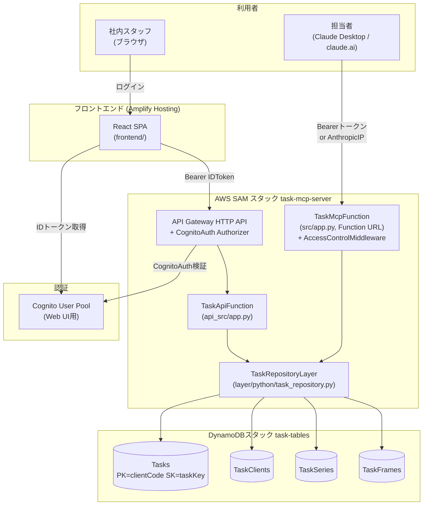

# タスク管理システム 設計書

最終更新: 2026-07-27
対象リポジトリ: `taskmanager`（AWS SAMモノレポ、スタック名 `task-mcp-server` / `task-tables`）
ステータス: **Client/Series/Frameモデルへの再設計が完了し、本番AWS環境へのデプロイ・動作確認済み**

> 本書はコードベース・インフラ定義（`template.yaml` / `tables.yaml` / `amplify.yml`）・README.md・コミット履歴、および実際のAWS環境への再設計・デプロイ作業の記録を突き合わせて作成した設計書である。個人〜社内数名運用の小規模システムであるため、正式なフレームワークに則った過剰な設計ドキュメントは避け、**現状の実装がなぜその形になっているか**を中心にまとめる。

---

## 1. システム概要

- **用途**: 社内のタックス事務所（BPO: Business Process Outsourcing業務）向けのタスク管理ツール。
- **利用者**: 社内スタッフ数名（Web UI経由）、および担当者本人（Claude Desktop / claude.ai経由の自然言語操作）。
- **中核ドメイン概念**: 「クライアント（Client）」に対して、「シリーズ（Series、業務の種類）× フレーム（Frame、対象月）」の組み合わせで最小単位の「タスク（Task）」を管理する。例:「クライアントAの資料受領・2026年6月分」。
- **最大の特徴**: **Web UIとClaude(MCP)という2つの利用インターフェースが、同一のDynamoDBデータソースを共有するデュアルインターフェース構成**。Web UIで更新した内容はClaude経由でも即座に参照でき、逆にClaude経由で作成・更新したタスクもWeb UI上でポーリング経由（4秒間隔）で確認できる。

### 開発の経緯（コミット履歴より）

| コミット | 日付 | 内容 |
|---|---|---|
| a87041c | 2026-06-30 | 初回コミット（27ファイル、6077行）。SAM + Lambda2種 + Reactフロントエンドの一式を一括構築 |
| b30d869 | 2026-06-30 | Amplifyモノレポビルド設定の修正（8-2参照） |
| c6fea0b | 2026-07-27 | `customerName` → `clientCode`/`clientName` へのドメイン用語統一 |
| 0e1b07a | 2026-07-27 | `setup手順.xlsx`（運用手順書）の更新 |
| e26b9e3 | 2026-07-27 | **ドメインモデルをClient/Series/Frameに再設計**（本書のメイン内容、13章に経緯を記録） |

作者は一貫して単独（`woodygaragelab`）。CI/CDやテストは未整備という前提を踏まえて読むこと。

---

## 2. 全体構成図



- インフラはCloudFormation/SAMで**2スタックに分離**されている: `task-tables`（DynamoDB、`tables.yaml`、独立ライフサイクル）と`task-mcp-server`（Lambda・Cognito・API Gateway、`template.yaml`）。テーブルを消さずにアプリ側だけ再デプロイできるようにする意図。
- 2つのLambda（Web API用・MCP用）は共通のLambda Layer（`task_repository`）を参照し、ビジネスロジックの二重実装を避けている。

---

## 3. 技術スタック

| レイヤ | 技術 |
|---|---|
| バックエンド言語 | Python 3.13 |
| MCPサーバー | `mcp`（公式SDK, `FastMCP`）+ `mangum`（ASGI→Lambdaアダプタ）+ `boto3` |
| Web API | フレームワーク不使用（API Gateway HTTP APIイベントを素朴にif分岐でルーティング）+ `boto3`（Lambda標準ランタイム同梱） |
| データストア | Amazon DynamoDB（`PAY_PER_REQUEST`、ORM・マイグレーションツール不使用） |
| 認証 | Amazon Cognito User Pool（Web UI）／独自Bearerトークン+IPホワイトリスト（MCP） |
| インフラIaC | AWS SAM（`AWS::Serverless-2016-10-31`） |
| フロントエンド | React 18 + Vite 5 |
| フロントエンド認証UI | `@aws-amplify/ui-react`（Authenticator）+ `aws-amplify` v6 |
| 状態管理 | なし（React標準の`useState`/`useEffect`のみ、Redux等未使用） |
| ルーティング | なし（実質1画面のstate駆動SPA、React Router未使用） |
| ホスティング | AWS Amplify Hosting（GitHub連携、pushで自動ビルド） |
| CI/CD | なし（Amplify Hostingの自動ビルドのみ、テスト実行やLintのパイプラインは未構築） |
| テスト | なし（テストコード・フレームワークともに未導入。動作確認はLambda直接invokeによる手動スモークテスト） |

---

## 4. ドメインモデル

### 4-1. 中核エンティティ

| エンティティ | 属性 | 説明 |
|---|---|---|
| **Client**（クライアント） | `clientCode`, `clientName` | 担当先。旧「案件（Case）」概念を廃止し統合した唯一のマスタ概念 |
| **Series**（シリーズ） | `seriesCode`, `seriesName` | 業務の種類。例:「資料受領」「資料整理」「データ入力」。クライアント横断の共通マスタ |
| **Frame**（フレーム） | `frameCode`（`YYYYMM`形式、例`202606`）, `frameName` | タスクの対象タイムフレーム。例:「2026年6月」。年ごとに別レコード |
| **Task**（タスク） | `clientCode`+`seriesCode`+`frameCode`（複合キー）, `status`, `assignee`, `completeDate` | 最小単位の作業。あるクライアントの、あるシリーズの、あるフレーム分の進捗を1レコードで表す |

**Client × Series × Frame の関係**:
- Series・Frameはクライアント横断の共通マスタ（クライアントごとの個別定義はしない）。
- Taskが`clientCode+seriesCode+frameCode`を持つことで「どのクライアントの・どの業務の・どの月分か」を一意に表す。
- Series・Frameは**事前登録不要**。存在しないコードでTaskを作成した時点で自動的にマスタへ追加される（「使ったら生成される」設計）。
- Clientのみ例外で、ドロップダウンからの明示的な新規登録操作（`create_client`/`POST /clients`）を持つ。理由は9-2参照。

### 4-2. ステータス

```
未着手 → 進行中 → 完了
```
3段階。ドロップダウンで任意の値へ自由に行き来できる（一方向固定ではない）。`completeDate`は`status`とは独立した手動入力項目。

### 4-3. 用語の変遷

初回コミット時点では「顧客」を表す`customerName`というキーが使われていたが、`clientCode`/`clientName`への改名を経て、最終的に「案件（Case）」という中間概念を廃し「クライアント（Client）」に一本化した。GSI名`CustomerStatusIndex`のような命名上の旧称残存は、今回の再設計でテーブルごと作り直したため解消済み。詳しい経緯は13章を参照。

`skill/bpo-task-manager/SKILL.md`という命名から、"BPO"（業務委託代行）＝税理士事務所などの外部委託業務向けであることが裏付けられる。

---

## 5. データモデル設計（DynamoDB）

DynamoDB（NoSQL、ORM・マイグレーション不使用、`boto3.resource("dynamodb")`を直接操作）。`tables.yaml`でLambdaスタック（`task-mcp-server`）とは別のCloudFormationスタック（`task-tables`）として管理。4テーブル構成、いずれも`BillingMode: PAY_PER_REQUEST`。

### 5-1. Tasks テーブル

```
PK: clientCode (String)
SK: taskKey (String, "{seriesCode}#{frameCode}" の連結文字列, 例 "SR001#202606")
属性: seriesCode, frameCode, status, assignee, completeDate, createdAt, updatedAt
```
`Query(PK=clientCode)`でクライアント別タスク一覧を取得。SKを`{seriesCode}#{frameCode}`の連結文字列にすることで、**追加のインデックスなしに「シリーズ内でフレーム順」の並びが手に入る**（`frameCode`が`YYYYMM`形式のため同一シリーズ内は時系列順）。単一タスクの取得・更新は`GetItem`/`UpdateItem(PK=clientCode, SK=taskKey)`で完結し、旧`taskId`のような代理キーは不要。「あるフレーム・あるシリーズを全クライアント横断で一覧する」というクエリは不要と判断したため、**GSIは持たない**。

### 5-2. TaskClients テーブル（クライアントマスタ）

```
PK: lookupBucket (String, 固定値 "CLIENT")
SK: clientCode (String)
属性: clientName
```
`Query(PK="CLIENT")`で登録済み全クライアントを一覧取得できる（クライアント選択ドロップダウン用）。

### 5-3. TaskSeries テーブル（シリーズマスタ）

```
PK: lookupBucket (String, 固定値 "SERIES")
SK: seriesCode (String)
属性: seriesName
```
`Query(PK="SERIES")`で登録済み全シリーズを一覧取得（タスク作成時のドロップダウン用）。

### 5-4. TaskFrames テーブル（フレームマスタ）

```
PK: lookupBucket (String, 固定値 "FRAME")
SK: frameCode (String, 例 "202606")
属性: frameName
```
`Query(PK="FRAME")`で登録済み全フレームを一覧取得。`frameCode`を`YYYYMM`のゼロ埋め文字列にしているため、**文字列ソートがそのまま時系列順になる**。

### 5-5. マスタ自動登録の一貫性

Series/Frameは、`ConditionExpression: attribute_not_exists(...)`付き`PutItem`で冪等に登録し、`ConditionalCheckFailedException`（＝既存）は正常系として握りつぶすパターンを共通で使用（`_ensure_series_exists()` / `_ensure_frame_exists()`）。Clientのみこのパターンを使わず、明示的な`create_client()`で登録し、既存の場合は`ClientAlreadyExistsError`として呼び出し元に伝える（9-2参照）。

---

## 6. バックエンド設計

### 6-1. `layer/python/task_repository.py` — 共通CRUDロジック（ビジネスロジックの中核）

Web API・MCPサーバーの両方から`import task_repository as repo`で参照される、フレームワーク非依存のプレーンな関数群。

| 関数 | 役割 |
|---|---|
| `list_clients()` | `Query(PK="CLIENT")`で全クライアント返す |
| `create_client(client_code, client_name)` | 冪等でなく、既存なら`ClientAlreadyExistsError` |
| `list_series()` | `Query(PK="SERIES")`で全シリーズ返す |
| `list_frames()` | `Query(PK="FRAME")`で全フレーム返す（`frameCode`昇順で自然に時系列順） |
| `list_tasks_by_client(client_code)` | `Query(PK=clientCode)`でタスク一覧（SK順＝シリーズ内でフレーム順） |
| `get_task(client_code, series_code, frame_code)` | `GetItem`。存在しなければ`TaskNotFoundError` |
| `create_task(client_code, series_code, series_name, frame_code, frame_name, status, assignee, complete_date)` | `_ensure_series_exists()`/`_ensure_frame_exists()`を経て`PutItem`。同じ複合キーが既存でも単純に上書きする |
| `update_task(client_code, series_code, frame_code, status, assignee, complete_date)` | 指定フィールドのみ`UpdateExpression`で動的構築 |

`_status_sort`のような複合ソートキー生成ロジックや`_next_task_id()`（旧`taskId`発番用アトミックカウンタ）は、SK自体（`taskKey`）が既にソート順と一意性を表現するため不要になり削除した。

### 6-2. `src/app.py` — MCPサーバー（Claude Desktop / claude.ai向け）

`FastMCP("task-manager", stateless_http=True, json_response=True, streamable_http_path="/")` によるStreamable HTTP方式のMCPサーバー。`TOOL_FUNCTIONS`に`task_repository`の8関数をそのまま`mcp.add_tool()`で登録し、MCPツールとして公開している（`list_clients` / `create_client` / `list_series` / `list_frames` / `list_tasks_by_client` / `get_task` / `create_task` / `update_task`）。

**Lambda呼び出しごとにアプリを再構築する設計**: `StreamableHTTPSessionManager.run()`はインスタンスごとに1回しか呼べない制約があるため、`FastMCP`インスタンスをモジュールレベルで使い回さず、`handler(event, context)`の呼び出し毎に`build_app()`で新規構築している（`stateless_http=True`はこの前提に基づく）。実行時は`Mangum(app, lifespan="auto")`でASGI→Lambdaイベント変換。

**認可（`AccessControlMiddleware`、StarletteのBaseHTTPMiddleware継承）**: Function URL自体の`AuthType`は`NONE`だが、アプリ内ミドルウェアで以下のいずれかを満たさない限り401を返す。
1. `Authorization: Bearer <MCP_AUTH_TOKEN>` が環境変数値と一致（Claude Desktop + mcp-remote経由）
2. 送信元IPがAnthropicの公開アウトバウンドIPレンジ（`160.79.104.0/21`）内（claude.ai/モバイルのカスタムコネクタ経由）

### 6-3. `api_src/app.py` — Web API（社内フロントエンド向け）

Flask/FastAPI等のフレームワークは使用せず、`event["routeKey"]`による素朴なif分岐でルーティングを自前実装している。

| Method | Path | 処理 | 備考 |
|---|---|---|---|
| GET | `/clients` | `repo.list_clients` | クライアント選択ドロップダウン用 |
| POST | `/clients` | `repo.create_client` | body: `clientCode,clientName`。既存なら409 |
| GET | `/series` | `repo.list_series` | タスク作成時のドロップダウン用 |
| GET | `/frames` | `repo.list_frames` | 同上。時系列順 |
| GET | `/clients/{clientCode}/tasks` | `repo.list_tasks_by_client` | シリーズ→フレーム順にソート済み |
| GET | `/tasks/{clientCode}/{seriesCode}/{frameCode}` | `repo.get_task` | 複合キーをパスパラメータ3つで表現 |
| POST | `/tasks` | `repo.create_task` | body: `clientCode,seriesCode,seriesName,frameCode,frameName,status?,assignee?,completeDate?` |
| PATCH | `/tasks/{clientCode}/{seriesCode}/{frameCode}` | `repo.update_task` | body: `status?,assignee?,completeDate?` |

- レスポンスは`_response()`ヘルパーでCORSヘッダとJSON形式（`ensure_ascii=False`で日本語をエスケープしない）を統一。
- エラーは`repo.ClientAlreadyExistsError`→409、`TaskNotFoundError`→404、`KeyError`/`ValueError`→400、その他`Exception`→500の4段階。
- JWT検証はこのLambda自身では行わず、**API Gateway側の`CognitoAuth`オーソライザーに委譲**している。

### 6-4. メール連携機能の廃止

旧モデルにあった`sourceThreadIds`（Gmailスレッド連携）・`link_email`は今回の再設計で完全に廃止した。`POST /tasks/{taskId}/emails`エンドポイント、MCPの`link_email`ツール、`task_repository.link_email()`関数をいずれも削除済み。`skill/SKILL.md` / `skill/bpo-task-manager/SKILL.md`にはメール連携についての記述がまだ残っており、**別途見直しが必要**（12章参照）。また README・SKILL.mdで言及されている`email_router.py`は本リポジトリに存在しない外部連携スクリプトであり、そちらの連携仕様変更は本リポジトリのスコープ外だが影響を受けることは関係者への伝達が必要。

---

## 7. フロントエンド設計

### 7-1. コンポーネント構成（`frontend/src/`）

```
main.jsx            エントリポイント。Amplify.configure() → Authenticatorでログイン画面をラップ
App.jsx             メイン画面。client/tasks/seriesList/frameListをトップレベルで保持
ClientSelector.jsx  全クライアントを一覧取得しオートコンプリート選択。未一致時は新規登録(createClient)
TaskTable.jsx       タスク一覧テーブル。シリーズ/フレーム名表示、担当はインライン編集、状態はStatusSelect
StatusSelect.jsx    3段階(未着手/進行中/完了)のドロップダウン
NewTaskForm.jsx     Series/Frameをドロップダウン選択。「+ 新規◯◯を追加」でインライン新規登録
api.js              fetchベースのAPIクライアント(Cognitoトークン付与)
config.js           デプロイ後の値(Cognito ID・APIエンドポイント)を反映する設定ファイル
```

### 7-2. `api.js` の構成

```js
export const api = {
  listClients, createClient, listSeries, listFrames,
  listTasksByClient, createTask, updateTask,
};
```
`authHeader()`（Cognito IDトークン付与）と`request()`（fetchラップ＋エラー変換）という共通ヘルパー構造は維持。旧`getClient`/`getTask(taskId)`/`linkEmail`は削除（`getTask`は実際にフロント側で使用箇所がなかったため新設もしていない＝YAGNI）。

### 7-3. マスタ名の解決（実装時に判明した設計上の必要事項）

`GET /clients/{clientCode}/tasks`が返すタスクは`seriesCode`/`frameCode`のみを持ち、表示用の名称（`seriesName`/`frameName`）を含まない。そのため`App.jsx`が`listSeries()`/`listFrames()`の結果からコード→名称の変換マップ（`seriesNameByCode`/`frameNameByCode`）を作成し、`TaskTable`にpropsで渡して表示時に解決する構成にした。タスク作成後は`refreshMasters()`でマスタ一覧も再取得し、新規登録されたシリーズ/フレームを次回のドロップダウンに反映する。

### 7-4. 状態管理・同期方式

- 状態管理: Redux等は不使用。`App.jsx`トップレベルの`useState`をpropsで配布する素朴な構成（変更なし）。
- ルーティング: React Router等は不使用。実質1画面のstate駆動アプリ（変更なし）。
- 疑似リアルタイム同期: `POLL_INTERVAL_MS = 4000`で4秒間隔ポーリングを継続。
- 楽観的UI更新: `handleUpdate`はAPIコール前にローカル状態を即時更新し、失敗時は`refresh()`でサーバー状態に揃え直す。

### 7-5. デザイン方針

社内のタックス事務所向け業務ツールという位置付けから、SaaS風ではなく「台帳・帳簿」をモチーフにした配色・タイポグラフィを採用。ステータス表示は日本の業務文書になじみのある「印影（はんこ）」風の見た目（`.stamp`系CSSクラス）をドロップダウンにも流用。CSS変数によるデザイントークン管理、フォントはShippori Mincho / Zen Kaku Gothic New / JetBrains Mono。

---

## 8. 認証・認可設計

2系統の認証方式が併存する（今回の再設計でも変更なし）。

### 8-1. Web UI向け（Cognito）
- User Pool: セルフサインアップ無効（`AdminCreateUserConfig.AllowAdminCreateUserOnly: true`）、管理者が`admin-create-user`でアカウント作成する運用。
- パスワードポリシー: 最小10文字、大文字/小文字/数字必須。
- API GatewayのHTTP APIに`CognitoAuth`というJWT Authorizerを全ルートのデフォルトとして適用。
- フロントエンドは`fetchAuthSession()`からIDトークンを取得し`Authorization: Bearer <IDToken>`を全リクエストに付与。
- **RBACなし**: ロールベースのアクセス制御は未実装。認証されたユーザーは全員同じ権限を持つ。

### 8-2. MCPサーバー向け（Bearer / IPホワイトリスト）
Cognitoは使わず、`AccessControlMiddleware`による固定Bearerトークンまたは Anthropic公開IPレンジでの認可。トークンは`NoEcho: true`のSAMパラメータとして管理（今回の再デプロイでも既存トークンをそのまま再利用し、Claude Desktop側の設定変更は不要）。

### 8-3. 既知のセキュリティ課題
`HttpApi.CorsConfiguration.AllowOrigins`が現状`"*"`のままであり、**本番運用前にAmplify Hostingの実ドメインへ限定する必要がある**（未対応、12章参照）。

---

## 9. 再設計における主要な意思決定

今回の再設計で確定した、コードだけでは読み取れない判断の背景をまとめる。

### 9-1. 「案件（Case）」を廃し「クライアント（Client）」に統一した理由
`clientCode`/`clientName`という属性名は既に「クライアント」を指していたにもかかわらず、ドキュメント上は「案件」と呼んでいたというズレがあった。また会社と個別案件を分離する設計（`companyName`/`caseName`）も検討したが、採用せず、単一の「クライアント」概念に一本化する方針とした。

### 9-2. Clientのみ`create_client`という明示的な登録手段を持つ理由
Series/Frameは「タスク作成時に未登録なら自動登録」という一貫した方針（4-1参照）だが、**Clientだけは例外的に専用の登録エンドポイント（`POST /clients`）を持つ**。理由: Clientはタスク作成に先立って画面上で単独に選択・登録される存在（`ClientSelector`のドロップダウンで「新規作成」操作がある）のに対し、Series/FrameはTask作成フローの中でのみ選択される付随的な存在であるため。この非対称性は意図的な設計判断であり、統一しなかった。

### 9-3. タスクをClient×Series×Frameに分解した理由
旧モデルの「1タスク＝1レコード、`要対応/決定済/情報/完了`のフラットなステータス」という粒度では、「毎月発生する定型業務の、どの月分がどこまで進んでいるか」を表現できなかった。「シリーズ（業務の種類）× フレーム（対象月）」に分解することで、「6月の資料受領は担当者佐藤により7/20に完了した」を素直に記録できるようにした。

### 9-4. `frameCode`を`YYYYMM`形式にした理由
「6月」を毎年繰り返す概念ではなく年を含む一回限りの概念として扱うことで、過去のフレームと現行のフレームが自然に区別され、かつ文字列ソートがそのまま時系列順になる（5-4参照）という設計上の利点も得られる。

### 9-5. GSIを持たない設計にした理由
「あるフレーム・あるシリーズのタスクを全クライアント横断で一覧する」というクエリ（例: 6月の資料受領を全クライアント分確認）は運用上不要と判断した。クライアント単位の確認が基本運用であるため、Tasksテーブルは複合ソートキー（`taskKey`）のみで要件を満たし、GSIを追加しない選択をした。将来この種の横断集計が必要になった場合は、GSIの追加を別途検討する。

### 9-6. 既存データを移行しなかった理由
新モデルは旧モデル（`taskName`/`dueDate`/`conclusion`/`sourceThreadIds`/`dependsOn`を持つフラットなタスク）と構造が大きく異なり、機械的な変換が困難なため、データ移行は行わずゼロから運用を開始する方針とした。加えて、実際のデプロイ作業中に旧テーブル（`Tasks`/`TaskCases`/`TaskCounters`）が別要因（10-2参照）で既に失われていたため、結果的にも移行対象データは残っていなかった。

---

## 10. インフラ・デプロイ構成

### 10-1. AWS SAM
- `task-tables`スタック（`tables.yaml`）: DynamoDB4テーブル（`Tasks`/`TaskClients`/`TaskSeries`/`TaskFrames`）の独立スタック。Lambdaスタックとは疎結合のライフサイクル。
- `task-mcp-server`スタック（`template.yaml`）: `TaskRepositoryLayer`（共通Layer）／`TaskMcpFunction`（Function URL）／`UserPool`+`UserPoolClient`（Cognito）／`HttpApi`（Cognito JWT Authorizer付き）／`TaskApiFunction`（8イベント定義）を1スタックにまとめたメインスタック。
- 両Functionとも`DynamoDBCrudPolicy`（SAM組み込みポリシーテンプレート）を4テーブルに付与。
- `samconfig.toml`: `stack_name = "task-mcp-server"`, `region = "ap-northeast-1"`, `capabilities = "CAPABILITY_IAM"`（`.gitignore`対象、リポジトリには含まれない）。

### 10-2. 再デプロイ時に発生したトラブルと対応（このマシン固有・恒久的な注記）

再設計後のデプロイ作業で、以下の問題が発生し解決した。将来再度デプロイする際の参考情報として残す。

| 問題 | 原因 | 対応 |
|---|---|---|
| `task-tables`スタックが`UPDATE_ROLLBACK_COMPLETE`のまま実テーブルが消失していた | 事前に（本セッション外で）新`tables.yaml`への更新が2回試行され、DynamoDBのキースキーマ変更はインプレース更新できず（GSI変更やHASH/RANGE変更は再作成が必要）、かつ固定名リソースの置き換えをCloudFormationが安全に行えず失敗・ロールバック。ロールバック後もスタック状態と実リソースがズレる「ドリフト」が発生していた | `task-tables`スタックを削除し、新`tables.yaml`で`CREATE_COMPLETE`として作り直した。実テーブルは既に消失していたため追加のデータ損失はなし |
| AWS CLIが`SSL: CERTIFICATE_VERIFY_FAILED`で失敗 | このマシンではNorton Antivirusが常駐しHTTPS通信をSSL検査(MITM)しており、AWS CLI(Python/botocore)がそのルート証明書を信頼していない | `AWS_CA_BUNDLE`環境変数にNortonの証明書（`C:\ProgramData\Norton\Antivirus\wscert.pem`）を指定 |
| `aws cloudformation deploy`実行時に`cp932`デコードエラー | `tables.yaml`のコメントに残っていた日本語文字が、このマシンのロケール(cp932)でファイル読み込み時にデコードできなかった | コメントを英語に修正 |
| `sam build`（コンテナなし）が`pywin32`の解決に失敗 | `mcp`パッケージが`sys_platform == "win32"`条件で`pywin32`に依存しており、Windows上でのネイティブビルドがLambdaのLinuxターゲットと噛み合わず失敗 | `sam build --use-container`でLinuxコンテナ内ビルドに切り替え |
| コンテナ内`pip`が`SSL: CERTIFICATE_VERIFY_FAILED`でPyPIに到達できない | コンテナ内のpipもNortonのMITM証明書を信頼していない | `--container-env-var-file`で`PIP_TRUSTED_HOST=pypi.org files.pythonhosted.org pypi.python.org`を注入し、該当ホストのSSL検証をスキップ |

これらは全て**この開発マシン固有の環境要因**であり、リポジトリのコード自体に問題があったわけではない。

### 10-3. デプロイ実績（2026-07-27）

| 項目 | 値 |
|---|---|
| `task-tables`スタック | `CREATE_COMPLETE`（Tasks / TaskClients / TaskSeries / TaskFrames） |
| `task-mcp-server`スタック | `UPDATE_COMPLETE` |
| Web APIエンドポイント | `https://izomsyzy21.execute-api.ap-northeast-1.amazonaws.com`（変更なし） |
| MCP Function URL | `https://okwmgkpa4nihlmbr47nzs6ynj40olrax.lambda-url.ap-northeast-1.on.aws/`（変更なし） |
| Cognito User Pool ID | `ap-northeast-1_WgwchFez1`（変更なし） |
| Amplify Hostingアプリ | `task-manager`（App ID `dlmpnhc94nzt3`） |
| デプロイ確認方法 | Lambda直接invokeによるWeb API/MCPの手動スモークテスト（テストデータは削除済み）、および実ブラウザでの一連の操作確認（ログイン〜クライアント選択〜タスク作成〜ステータス変更） |

Lambda・API Gateway・Cognitoのリソース自体は置き換えられていないため、`frontend/src/config.js`のCognito ID/APIエンドポイントは変更不要だった。

### 10-4. Amplify Hosting（フロントエンド）
`amplify.yml`は**リポジトリルート直下**に配置する必要がある（`appRoot: frontend`を明示するモノレポ形式）。

**b30d869「Fix Amplify monorepo build config」の経緯**: 当初`frontend/amplify.yml`に`applications`キーなしのシンプル形式で配置していたが、Amplify Hostingのモノレポ検出との不整合で`Monorepo spec provided without "applications" key`エラーが発生。`applications`キーで`appRoot: frontend`を明示する形式に書き換え、ルート直下に移動して解消した。

デプロイフロー: GitHub連携 → `main`ブランチpushごとに自動ビルド・デプロイ。今回の再設計もコミット`e26b9e3`のpushにより自動ビルドが起動し、`SUCCEED`を確認済み。

### 10-5. CI/CD・テスト
GitHub Actions等のCIパイプラインは存在しない。バックエンドは手動`sam deploy`、フロントエンドはAmplify Hostingのpush検知ビルドのみ。テストコード・テストフレームワークともに未導入（12章参照）。

---

## 11. 設定・環境変数

`.env`ファイルは存在せず、設定は2箇所に分散している。

**バックエンド（Lambda環境変数、`template.yaml`定義）**:
```
TASKS_TABLE=Tasks, CLIENTS_TABLE=TaskClients, SERIES_TABLE=TaskSeries, FRAMES_TABLE=TaskFrames   （両Function共通）
MCP_AUTH_TOKEN                                                                                     （TaskMcpFunctionのみ、NoEcho）
```
`task_repository.py`はモジュールロード時に`os.environ[...]`を必須参照するため、未設定だと起動時に即座に失敗する。

**フロントエンド（`frontend/src/config.js`、ビルド時に静的埋め込み）**:
```js
amplifyConfig.Auth.Cognito.userPoolId / userPoolClientId
API_BASE_URL
```
`sam deploy`のOutputs値を手動でこのファイルに反映する運用。環境ごとの分岐（dev/staging/prod）は存在しない（単一環境: `ap-northeast-1`のみを想定）。

---

## 12. 未実装・今後の検討事項（既知の課題の棚卸し）

| # | 課題 | 影響 |
|---|---|---|
| 1 | CORS設定が`AllowOrigins: "*"` | 本番運用前にAmplifyの実ドメインへ限定が必要（セキュリティ） |
| 2 | `skill/SKILL.md` / `skill/bpo-task-manager/SKILL.md`のメール連携記述が未更新 | メール連携機能（`link_email`）は廃止済みだが、Claude Skillの振る舞い指示書には旧仕様の記述が残っている |
| 3 | ポーリング方式（4秒間隔）でのタスク一覧更新 | DynamoDB Streams + AppSyncまたはWebSocket APIへの置き換えでリアルタイム性向上の余地 |
| 4 | RBAC（権限分離）なし | 利用者が増えた場合、担当者ごとのアクセス制御が必要になる可能性 |
| 5 | テスト・CI/CD未整備 | 変更の回帰確認が手動デプロイ後の目視・スモークテストのみ |
| 6 | `POST /clients`の重複時エラー仕様（409）が実運用で十分か未検証 | フロントエンドの`ClientSelector`でのエラー表示は簡易的なもの。実運用で問題が出れば見直す |

---

## 13. 参照した主要ファイル

- `README.md` / `template.yaml` / `tables.yaml` / `amplify.yml` / `samconfig.toml`
- `src/app.py` / `src/requirements.txt`
- `api_src/app.py`
- `layer/python/task_repository.py`
- `frontend/src/*.jsx` / `frontend/src/api.js` / `frontend/src/config.js` / `frontend/package.json`
- `skill/SKILL.md` / `skill/bpo-task-manager/SKILL.md`
